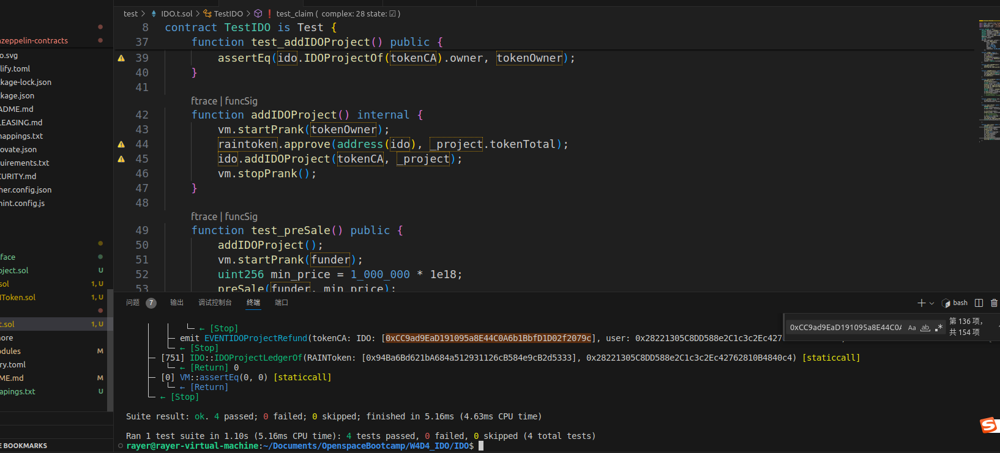

# 题目

编写 IDO 合约，实现 Token 预售，需要实现如下功能：

1. 开启预售: 支持对给定的任意ERC20开启预售，设定预售价格，募集ETH目标，超募上限，预售时长。
2. 任意用户可支付ETH参与预售；
3. 预售结束后，如果没有达到募集目标，则用户可领会退款；
4. 预售成功，用户可领取 Token，且项目方可提现募集的ETH；

**提交要求**

1. 编写 IDO 合约 和对应的测试合约
2. 截图 foundry test 测试执行结果
3. 提供 github IDO合约源码链接

# 运行结果

